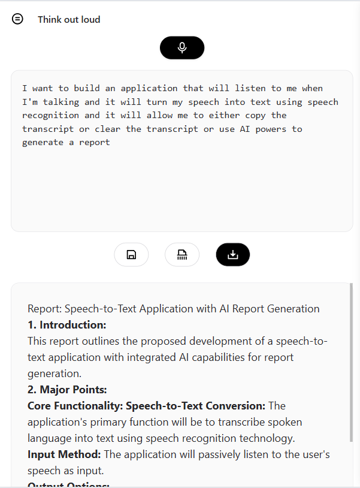
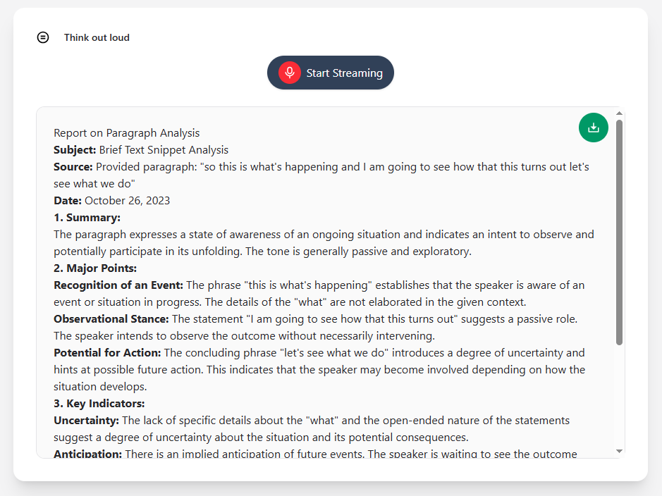
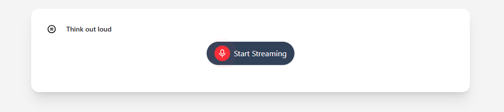
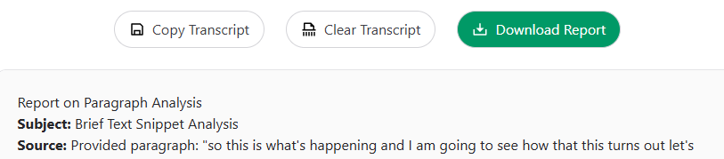
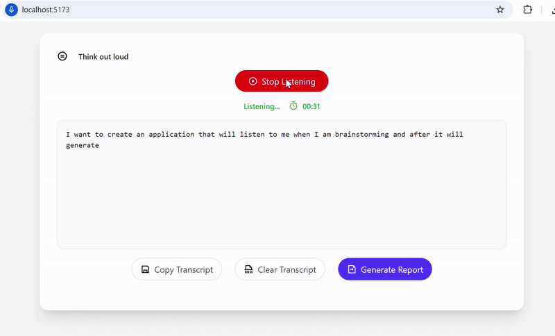
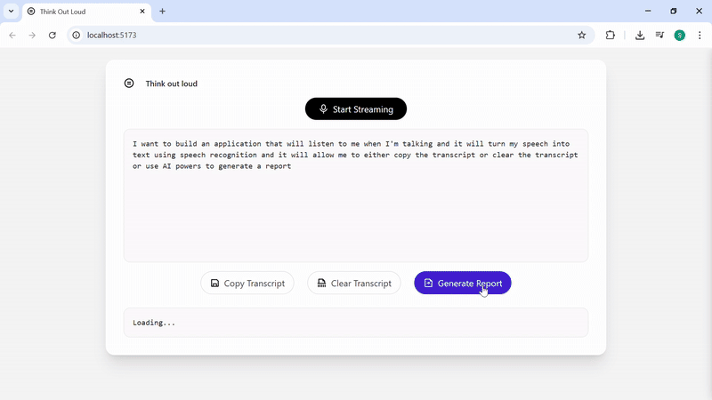

# Think Out Loud

**Think Out Loud** is a sleek, modern web application designed to help you capture your thoughts in real time simply by speaking. Whether you're brainstorming, journaling, or outlining ideas — just hit record and speak your mind.

---

## Mobile Preview



---

## Updated UI Preview

<table>
  <tr>
    <td></td>
    <td>
      <br/><br/><br/>
      
    </td>
  </tr>
</table>
---

## Demos

### Speech Recognition in Action  


### Report View  


---

## Features

- **Real-time Speech-to-Text**  
  Transcribes your voice into text live using the browser’s WebKit Speech Recognition API.

- **Live Transcript Viewer**  
  See your spoken words appear instantly on the screen, formatted in a readable way.

- **Session Timer**  
  Automatically tracks how long you’ve been talking.

- **Download Your Thoughts**  
  Save your transcript as a `.txt` file with one click.

- **Clear Notes**  
  Quickly clear your transcript and start fresh.

- **AI-Powered Report Generation**
  Once your speech is transcribed, send it to a powerful backend built with Spring Boot and Gemini AI to automatically summarize and format your thoughts into a polished report.
  
- **Export to Word**
  Instantly download your AI-generated report as a .docx file — ready to share, print, or archive.
  
- **Sleek UI with Tailwind CSS**  
  Designed with a modern, Apple-inspired theme using Tailwind CSS.

---

## Tech Stack

- **Frontend**: React, TypeScript, Tailwind CSS, WebKit Speech Recognition API
- **Backend**: Spring Boot (WebFlux), Gemini AI API, Apache POI (for Word document generation)
- **Architecture**: Modular design with smart/presentational components and custom hooks for clean separation of logic and UI

---

## Architecture

This app uses a **smart/dumb component architecture** for optimal separation of concerns:

| Layer | Description |
|-------|-------------|
| `useSpeechRecognition` | Custom hook for handling voice input |
| `useTimer` | Custom hook for session time tracking |
| `getTranscriptActions` | Logic for downloading and clearing transcripts |
| `SpeechToText.tsx` | Presentational component — purely renders UI |

---

---

## Folder Structure

```
src/ 
├── components/ 
│  └── SpeechToText.tsx 
├── hooks/ 
│  ├── useSpeechRecognition.ts 
│  ├── useTimer.ts 
│  └── useTranscriptActions.ts 
├── utils/ 
│  └── helpers
asset/
│  └── image assets
```

## Getting Started

```bash
git clone https://github.com/sanMakesApps/think-out-loud.git
cd think-out-loud
npm install
npm run dev
